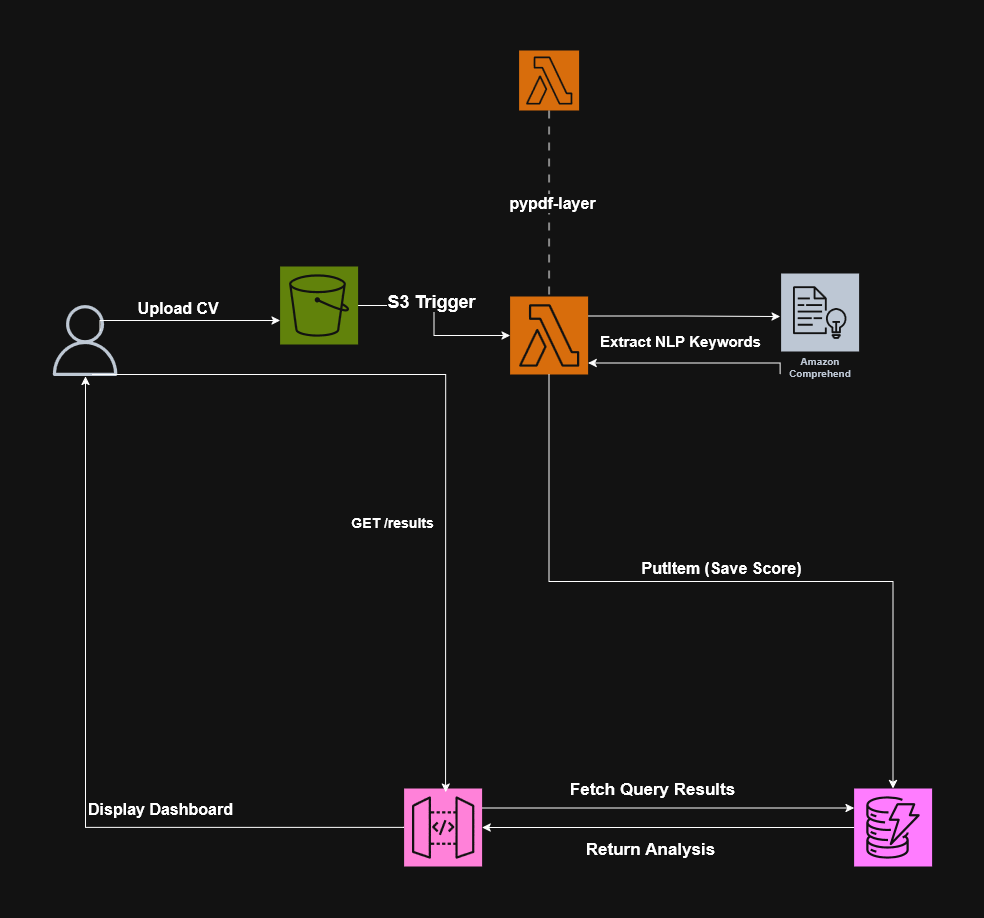
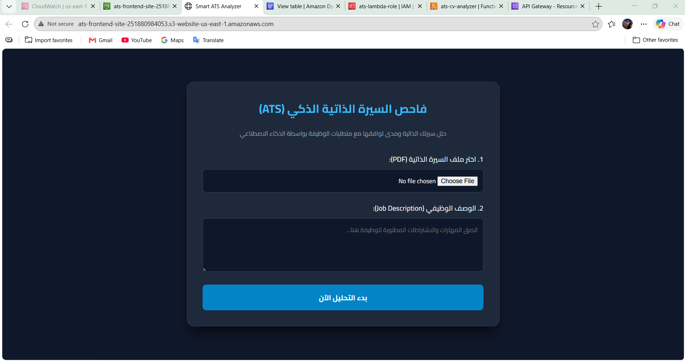
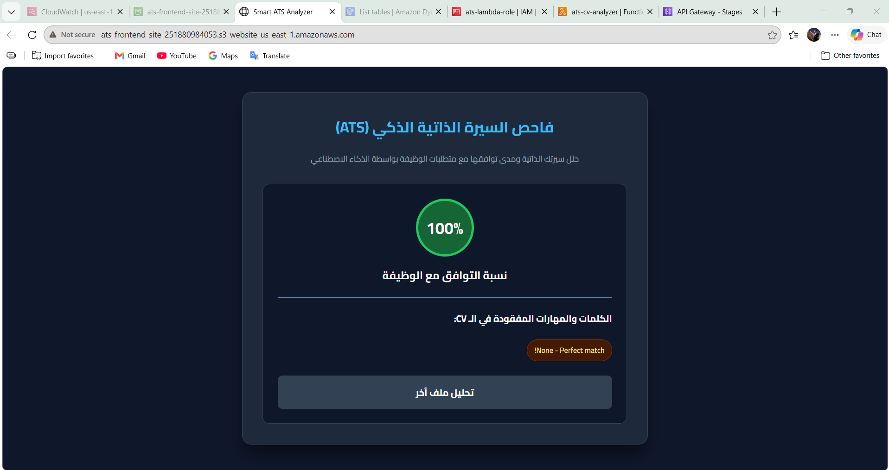
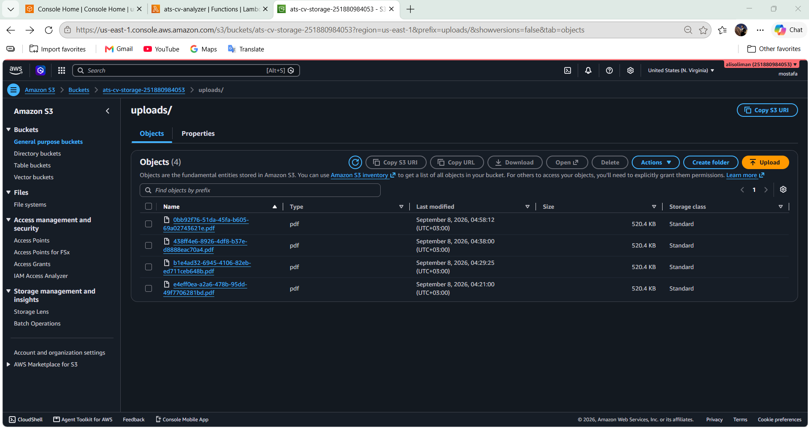
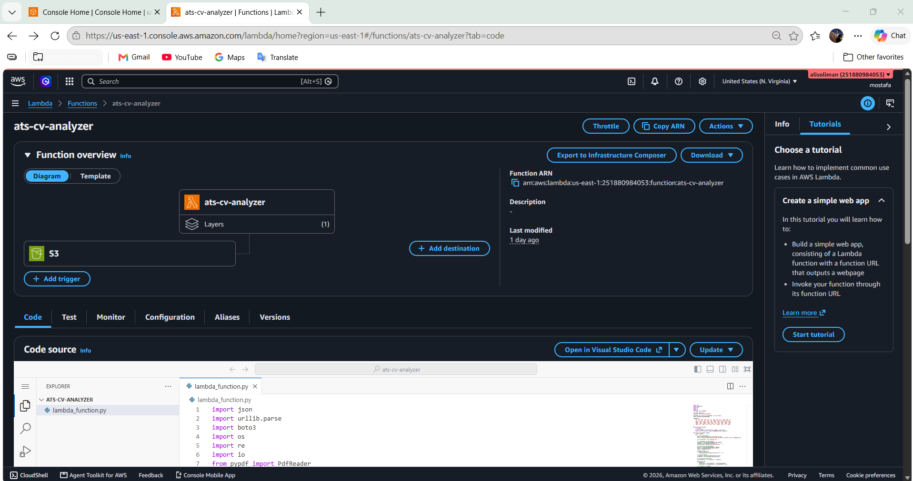
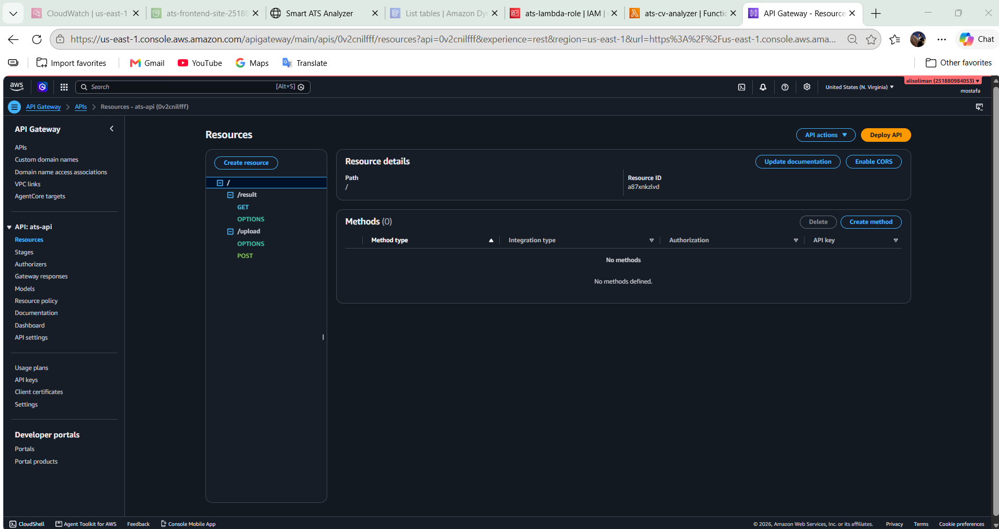
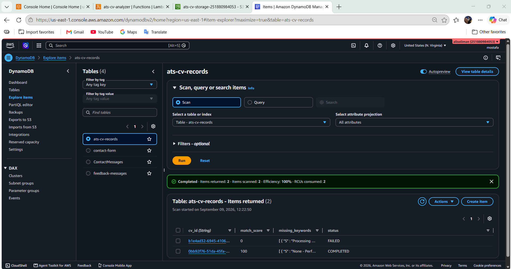
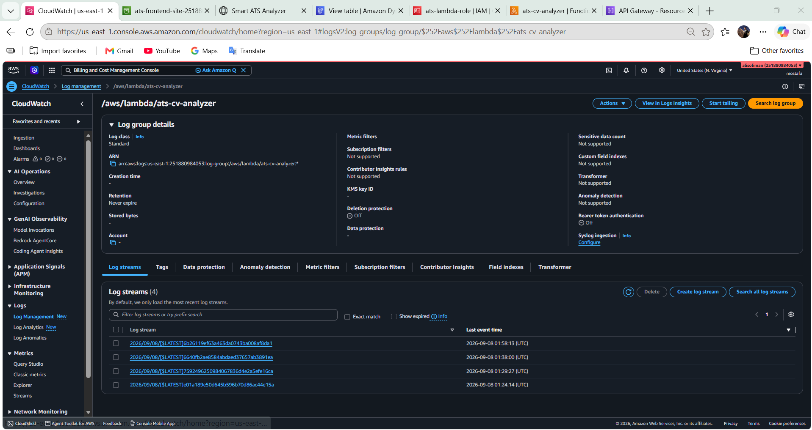

# 📄 Serverless ATS Resume Analyzer


Serverless ATS Resume Analyzer is a cloud-native, fully automated application designed to evaluate candidate resumes against job descriptions using AI/NLP keyword extraction. It leverages S3 for frontend and PDF storage, AWS Lambda with a PyPDF layer for processing, Amazon Comprehend for natural language keyword extraction, DynamoDB for analysis records, and API Gateway for seamless web interface interaction.

---

## 📑 Table of Contents
- [Overview](#-overview)
- [Features](#-features)
- [Architecture](#-architecture)
- [AWS Services Used](#aws-services-used)
- [Project Structure](#-project-structure)
- [Screenshots](#-screenshots)
- [Author](#-author)

---

## 🎯 Overview

This project provides a production-ready, serverless ATS (Applicant Tracking System) tool built entirely on AWS. When a user uploads a resume (PDF) alongside a job description through the web interface, the file triggers an automated pipeline: extracting text via PyPDF, analyzing key skill phrases with Amazon Comprehend, calculating a match percentage, and storing structured results in DynamoDB for real-time dashboard display.

---

## 🚀 Features

- ✅ **Automated Event-Driven Pipeline:** S3 Bucket Triggers automatically invoke AWS Lambda upon PDF uploads.
- ✅ **PDF Text Extraction:** Integrated Lambda Layer running `pypdf` to parse raw PDF text in-memory.
- ✅ **NLP Keyword Analysis:** Uses Amazon Comprehend to extract technical entities and key phrases.
- ✅ **Dynamic Match Scoring:** Calculates job description compatibility and identifies missing skill keywords.
- ✅ **NoSQL Data Persistence:** Instant recording of processing state, score, and output in DynamoDB.
- ✅ **Observability:** Centralized CloudWatch logging for error tracking and runtime debugging.
- ✅ **100% Serverless & Cost-Optimized:** Built completely on AWS Free Tier services with zero infrastructure maintenance.

---

## 📐 Architecture



**Flow:**
1. User uploads a CV (PDF) through the web interface, and the file is stored in the **S3 Bucket**.
2. An **S3 Trigger** automatically invokes **AWS Lambda** upon object creation.
3. Lambda uses a **PyPDF Layer** (attached as a Lambda Layer) to extract the raw text from the PDF in-memory.
4. The extracted text is sent to **Amazon Comprehend** to extract NLP keywords and key phrases relevant to the job description.
5. Lambda calculates the match score and performs a **PutItem** operation to save the results in **Amazon DynamoDB**.
6. The frontend calls **GET /results** through **API Gateway**, which fetches the analysis from DynamoDB and returns it to the dashboard for display.

---

## 🛠 AWS Services Used

| Service | Role | Free Tier Limit |
| :--- | :--- | :--- |
| **Amazon S3** | Hosts web interface & stores uploaded CV PDFs | 5GB storage |
| **AWS Lambda** | Backend execution, PDF parsing, & scoring logic | 1M requests/month |
| **Amazon Comprehend** | Natural Language Processing (NLP) keyword extraction | 50,000 units/month |
| **Amazon DynamoDB** | Stores analysis scores & missing skill records | 25GB storage |
| **Amazon API Gateway** | REST API endpoints (`/upload`, `/results`) | 1M requests/month |
| **Amazon CloudWatch** | Execution logs & monitoring | 5GB logs |

---

## 📁 Project Structure

```text
aws-ats-cv-analyzer/
├── Frontend/
│   ├── index.html        # Web form interface
│   ├── script.js         # API integration & dynamic frontend JS
│   └── style.css         # UI design & styling
├── lambda/
│   └── lambda.py         # Python backend logic & AWS SDK integration
├── screenshots/          # Architecture diagram & application proofs
│   ├── architecture.png
│   ├── ATS-Analyzer.png
│   ├── API.png
│   ├── s3-uploads-bucket.png
│   ├── DynamoDB-items.png
│   ├── view.png
│   ├── result.png
│   └── logs.png
├── .gitignore
└── README.md
```

---

## 📸 Screenshots

### 1. User Interface

*Web interface for uploading resume PDFs and pasting job descriptions.*

### 2. Analysis Result Dashboard

*Calculated compatibility match percentage and missing skills feedback.*

### 3. S3 Bucket Storage

*Uploaded CV PDF files stored in the S3 uploads directory.*

### 4. AWS Lambda Function

*Lambda function configuration with S3 Event Trigger and PyPDF Layer.*

### 5. Amazon API Gateway

*REST API Gateway resources configured for upload and result fetch endpoints.*

### 6. DynamoDB Table Records

*Processed CV entries, match scores, and missing keyword arrays in DynamoDB.*

### 7. CloudWatch Observability

*Execution log streams and runtime monitoring on CloudWatch.*

---

## 👤 Author

**Mostafa Mohamed Abdrabo**

[](https://www.linkedin.com/in/mostafa-m-abdrabo/)
[](https://github.com/mostafaabdrabo2022)
[](mailto:mostafaabdrabo4900@gmail.com)

---